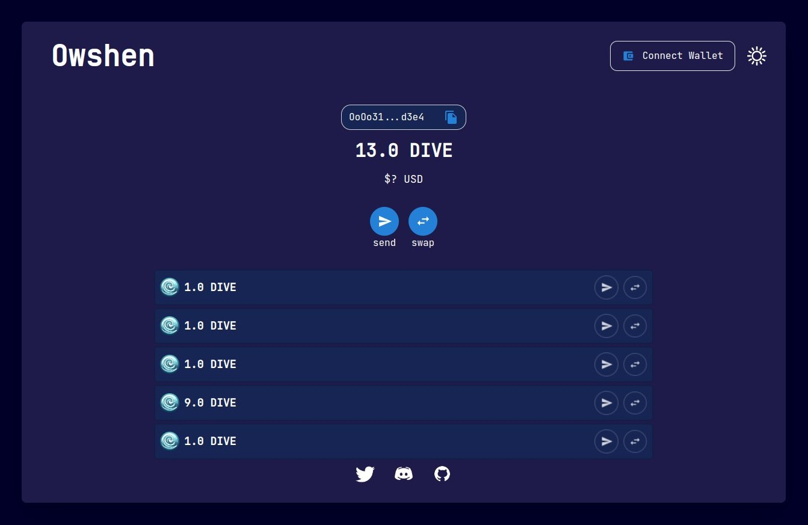

# Owshen Wallet

### Owshen wallet consist of a React application that served via core.

Owshen Wallet integrate with Metamask wallet and its duty is handle depositing and sending via Metamask wallet, showing the UTXOs (coins) in general make better user experiences.

